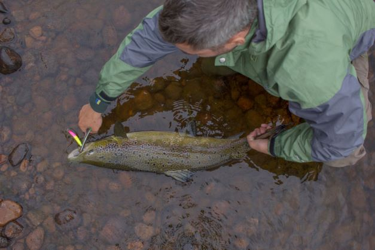

[Course Overview](index.md) \> Fitting linear models

# Fitting linear models: recreational catch data example

This is the first part of the course. It introduced basic concepts of fitting linear statistical models to data. You will learn about balanced data, outliers and their detection, zero data, as well as normality, homogeneity and collinearity of dependent variables. Using an example data set, you will standardise recreational catch data based on effort and season, explore the interaction of dependent variable and assess model residuals. You will also learn how to visualise and interpret simple linear model outputs. We will use an example data of recreational trout catches.

## Data and scripts

The [R script](Trout1.R) and the example [dataset](trout.csv). You can also access all the scripts and datasets from the course [GitHub page](https://github.com/fishsizeproject/CPUEcourse).

## Slides and video

Course slides will be available here.

 

The tutorial video from the online course meeting

## Further resources

Links to further resources will be added here briefly.

 
