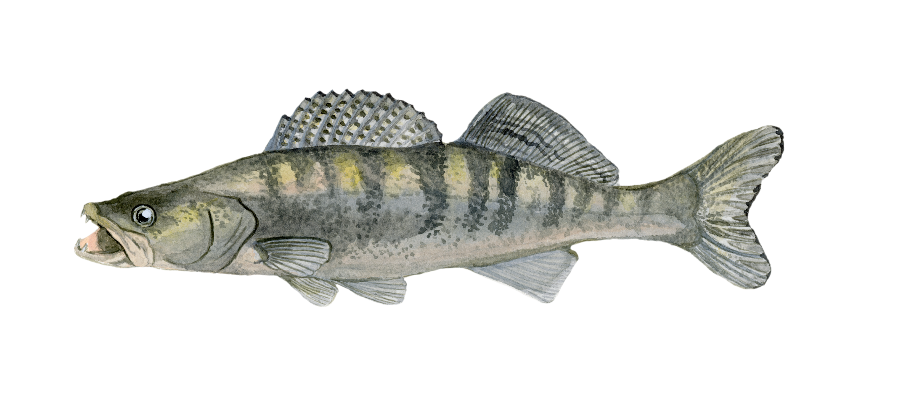

[Course Overview](index.md) \> Time series analysis and Bayesian inference

# Time series analysis and Bayesian inference

This is the final and most advanced part of the course, where we tackle time series analysis in CPUE standartisation data. Most CPUE standartisation aims to assess changes in catches through time, so time series analysis is one of the most relevant topics. However, it is also challenging because of autocorrelation between years and possibly also survey stations. Autocorrelation means that catches in one year are typically not independent from catches in the next year. In this module we will learn the basics of approximate Bayesian inference using the [INLA package](https://www.r-inla.org/). You will learn how to write and analyse basic models and interpret model results. The example data set uses data from 22 years of commercial pikeperch or zander (Sander lucioperca) catches in the northern Baltic Sea.

## Data and scripts

The [R script](Zander1.R) and the example [dataset](zander.csv). You can also access all the scripts and datasets from the course [GitHub page](https://github.com/fishsizeproject/CPUEcourse).

## Slides and video

Course slides can be downloaded here. The tutorial video from the online course meeting will be available here after November 24.

## Further resources

Links to further resources can be added here.

 
